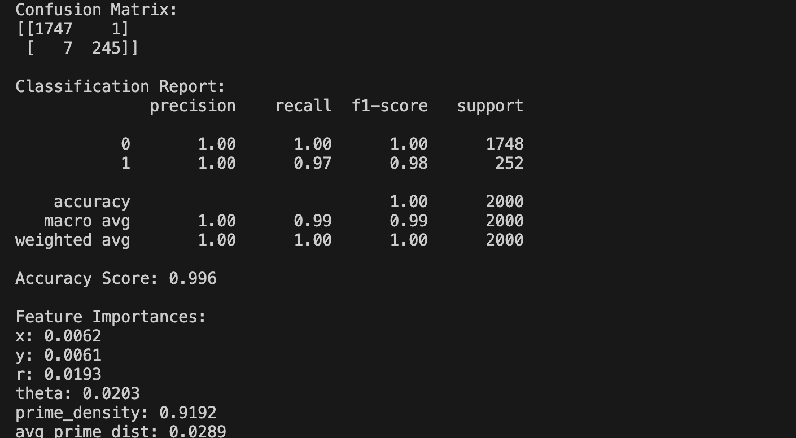

# prime-numbers-spirals

This repository corresponds to **Article 0** of a broader research project on geometric representations of prime numbers.

The focus here is the **historical and geometric construction of a polar spiral embedding of prime numbers**, prior to the introduction of halo-based density analysis.

---

## Scope of This Work 

This repository investigates:

- The construction of polar spirals for natural numbers and for primes only
- The emergence of geometric regularity when primes are embedded in polar coordinates
- Distance patterns between primes separated by fixed index steps
- Statistical regularity across multiple discrete scales

This work does **not** introduce halo structures or local density fields. These topics are addressed in subsequent articles.

---

## Important Note on the Spiral Index

In the prime-only spiral constructions, angular and radial increments are applied **only when a prime number is detected**.

As a result:
- The geometric index of the spiral corresponds to the **order of primes**
- It does **not** correspond directly to the natural number n

This distinction is fundamental for the interpretation of all geometric patterns shown in this work.

---

## Code Overview

### Visualization

- `spiral_all_numbers.py`  
  Displays the polar spiral of natural numbers up to n = 1000, highlighting primes.

- `prime_spiral.py`  
  Displays a polar spiral constructed exclusively from prime numbers.

- `prime_spiral_with_parallel_arc_connections.py`  
  Connects primes separated by fixed index steps (e.g., 63), revealing quasi-parallel arc structures.

---

### Distance Analysis

- `prime_spiral_generate_csv.py`  
  Computes Euclidean distances between prime points separated by fixed index steps (63, 126, 189).

- `prime_spiral_distances_columns.csv`  
  Contains the resulting distance sequences.

Note: NaN values appear naturally near the end of the dataset, as distances beyond the available prime index cannot be computed. These values are excluded from statistical analysis.

---

### Exploratory Machine Learning

- `dataset_generator_csv_random_forest.py`
- `train_and_analyze_random_forest.py`

These scripts explore whether geometric features derived from the spiral embedding carry information correlated with primality. This analysis is exploratory and not presented as a predictive theory.

---

## Paper

This document provides the mathematical motivation, experimental setup, and interpretation of the results.

*Geometric Regularity in the Distribution of Prime Numbers on Polar Spirals*
[Document](https://docs.google.com/document/d/11sa36fFxUokgMzjVDVdVdCFUfjkujBwkSI9eKV9YrwQ/edit)


## How to Run

0. (1 time only): Create your env
```bash
   python3 -m venv names_env
```

1. Activate your env
```bash
   source names_env/bin/activate
```

2. git clone
```bash
git clone git@github.com:tacigomess/prime-numbers-spirals.git
```

3. Install the dependencies:
```bash
pip install -r requirements.txt
```

## Code
   
1. [Only visual to generate graphics]
- `spiral_all_numbers.py`: Shows the spiral with all natural numbers up to [n = 1000] with the prime numbers highlighted in red.


- `prime_spiral.py`: Shows the spiral with only prime numbers up to [n = 1000].


- `prime_spiral_with_parallel_arc_connections.py`: Shows the spiral with parallel Arcs - prime numbers up to [n = 1000].


2. [Distance Calculation]
- `prime_spiral_generate_csv.py`: Generate a dataset with distances from 10,000 numbers
- `prime_spiral_distances_columns.csv`: Dataset (.csv) with distances from 10,000 numbers
- `prime_spiral_calculate_metrics_from_csv.py`: Calculate the metrics with all distances
 

3. [Random Forest Classifier] - [Classifier and Dataset]
- Generated Dataset to Random Forest Classifier
- `features_names.txt`: Names/description of all features in the database for the Random Forest Classifier
- `prime_spiral_features_dataset.csv`: Dataset with 10,000 numbers

- code: `dataset_generator_csv_random_forest.py` to generate: `prime_spiral_features_dataset.csv`

This dataset included geometric and local context features for each number from 2 to 10,000.
-  Features used for classification:
-  n, x, y, r, theta, is_prime, prime_density, avg_prime_dist
-  x, y: Cartesian coordinates in the spiral
-  r, θ: Polar coordinates (radius and angle)
-  Prime density: Number of primes within a 10-unit radius
-  Average distance to nearby primes
-  Target variable: Whether the number is prime (1) or not (0)
  
Training the classifier: `train_and_analyze_random_forest.py`

