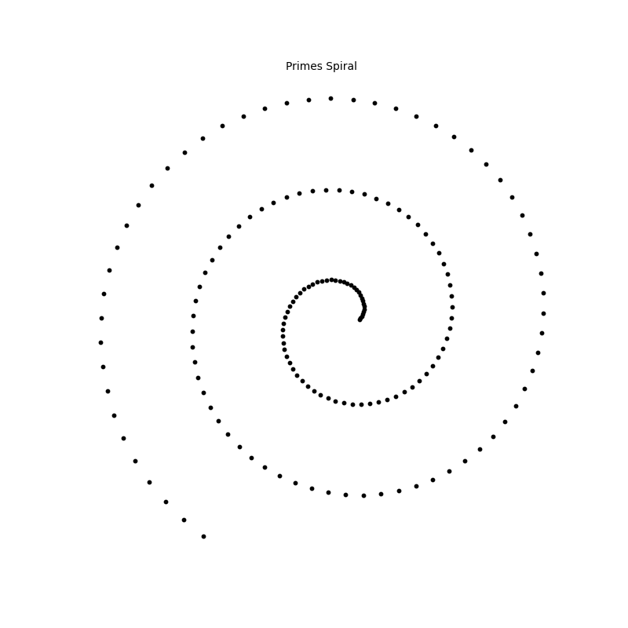
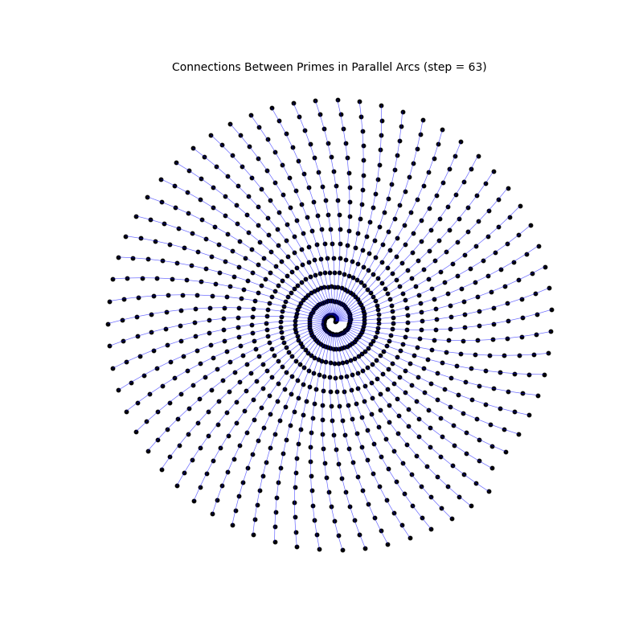

# prime-numbers-spirals
Paper: Geometric Regularity in the Distribution of Prime Numbers on Polar Spirals

[Document](https://docs.google.com/document/d/11sa36fFxUokgMzjVDVdVdCFUfjkujBwkSI9eKV9YrwQ/edit?tab=t.0)

## How to Run

0. (1 time only): Create your env
```bash
   python3 -m venv names_env
```

1. Activate your env
```bash
   source names_env/bin/activate
```

2. Install the dependencies:
```bash
pip install --upgrade pip
pip install -r requirements.txt
```

3. git clone
```bash
git clone git@github.com:tacigomess/prime-numbers-spirals.git
```

## Summary of the Code
   
1. [Only visual to generate graphics]
- `spiral_all_numbers.py`: Shows the spiral with all natural numbers up to [n = 1000] with the prime numbers highlighted in red.


- `prime_spiral.py`: Shows the spiral with only prime numbers up to [n = 1000].


- `prime_spiral_with_parallel_arc_connections.py`: Shows the spiral with parallel Arcs - prime numbers up to [n = 1000].


2. [Distance Calculation]
- `prime_spiral_generate_csv.py`: Generate a dataset with distances from 10.000 numbers
- `prime_spiral_distances_columns.csv`: Dataset (.csv) with distances from 10.000 numbers
- `prime_spiral_calculate_metrics_from_csv.py`: Calculate the metrics with all distances
- 
3. [Classifier and Dataset]
- Generated Dataset to Random Forest Classifier
- `features_names.txt`: Names/description of all features in the database for the Random Forest Classifier
- `prime_spiral_features_dataset.csv`: Dataset with 10.000 numbers
-
- 3.1 [Random Forest Classifier]
- 
- Features: `dataset_generator_csv_random_forest.py`
- This dataset included geometric and local context features for each number from 2 to 10,000.
- Features used for classification:
   n,x,y,r,theta,is_prime,prime_density,avg_prime_dist
   x, y: Cartesian coordinates in the spiral
   r, θ: Polar coordinates (radius and angle)
   Prime density: Number of primes within a 10-unit radius
   Average distance to nearby primes
   Target variable: Whether the number is prime (1) or not (0)
- 
- 
- Code used for training the classifier: `train_and_analyze_random_forest.py`
- 
- Confusion Matrix:
[[1747    1]
 [   7  245]]

Classification Report:
              precision    recall  f1-score   support

           0       1.00      1.00      1.00      1748
           1       1.00      0.97      0.98       252

    accuracy                           1.00      2000
   macro avg       1.00      0.99      0.99      2000
weighted avg       1.00      1.00      1.00      2000

Accuracy Score: 0.996
4. [General Files]
- `requirements.txt`: Python dependencies
  
## Author
- TAGC - tacigomess@me.com
