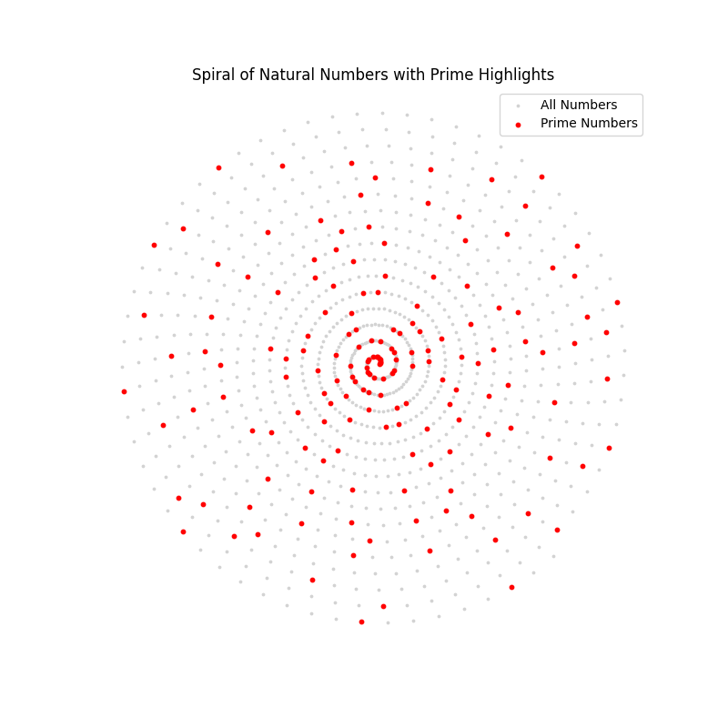

# prime-numbers-spirals
Paper: Geometric Regularity in the Distribution of Prime Numbers on Polar Spirals

Describe later...

## How to Run

0. (1 time only): Create your env
```bash
   python3 -m venv names_env
```

1. Activate your env
```bash
   source names_env/bin/activate
```

2. Install the dependencies:
```bash
pip install --upgrade pip
pip install -r requirements.txt
```

3. git clone
```bash
git clone git@github.com:tacigomess/prime-numbers-spirals.git
```

## Summary of the Code
   
1. [Only visual to generate graphics scripts]
- `spiral_all_numbers.py`: Shows the spiral with all natural numbers up to [n = 1000] with the prime numbers highlighted in red.


- `prime_spiral.py`: Shows the spiral with only prime numbers up to [n = 1000].

2. [Distance Calculation]
- `prime_spiral_generate_csv.py`: Generate a dataset with distances from 10.000 numbers
- `prime_spiral_distances_columns.csv`: Dataset (.csv) with distances from 10.000 numbers
- `prime_spiral_calculate_metrics_from_csv.py`: Calculate the metrics with all distances

3. [Classifier and Dataset]
- COMO GERAR O DATASET? 
- `features_names.txt`: Names/description of all features in the database for the Random Forest Classifier
- `prime_spiral_features_dataset.csv`: Dataset with 10.000 numbers
- ClASSIFICADOR
- METRICAS

4. [General Files]
- `requirements.txt`: Python dependencies
  
## Author
- TAGC - tacigomess@me.com
